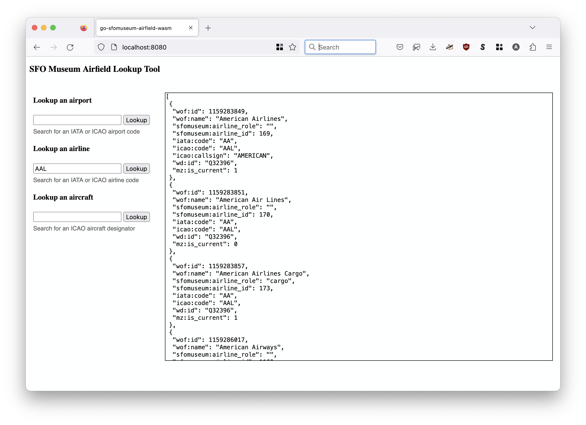

# go-sfomuseum-airfield-wasm

Go package for compiling methods from the [go-sfomuseum-airfield](https://github.com/sfomuseum/go-sfomuseum-airfield) package to a JavaScript-compatible WebAssembly (wasm) binary. It also provides a net/http middleware packages for appending the necessary static assets and HTML resources to use the wasm binary in web applications.

## Use

To build the `sfomuseum_airfield.wasm` binary run the `make wasm` command, like this:

```
$> make wasm
GOOS=js GOARCH=wasm go build -mod vendor -ldflags="-s -w" -o static/wasm/sfomuseum_airfield.wasm cmd/lookup/main.go
```

This will create a new WASM binary in the `static/wasm` folder.

In order to use the WASM binary in your JavaScript you will need to include the `wasm_exec.js` library that is packaged with the Go programming language. You can also grab a copy from the [sfomuseum/go-http-wasm](https://github.com/sfomuseum/go-http-wasm/blob/main/static/javascript/wasm_exec.js) package. For details on how to work with the `wasm_exec.js` library please consult the [Go WebAssembly wiki page](https://github.com/golang/go/wiki/WebAssembly).

## Functions

The `sfomuseum_airfield.wasm` WASM binary exports the following methods with return Javascript [Promises](https://developer.mozilla.org/en-US/docs/Web/JavaScript/Reference/Global_Objects/Promise):

### sfomuseum_lookup_airport

Return a list of SFO Museum airport records matching an IATA or ICAO airport code.

```
	sfomuseum_lookup_airport("KSFO")
	    .then((data) => { ... });
```

Data is sourced from [sfomuseum-data/sfomuseum-data-whosonfirst](https://github.com/sfomuseum-data/sfomuseum-data-whosonfirst).

### sfomuseum_lookup_airline

Return a list of SFO Museum airline records matching an IATA or ICAO airport code.

```
	sfomuseum_lookup_airline("AFR")
	    .then((data) => { ... });
```

Data is sourced from [sfomuseum-data/sfomuseum-data-enterprise](https://github.com/sfomuseum-data/sfomuseum-data-enterprise).

### sfomuseum_lookup_aircraft

Return a list of SFO Museum airline records matching a ICAO aircraft desginator.

```
	sfomuseum_lookup_aircraft("B747")
	    .then((data) => { ... });
```

Data is sourced from [sfomuseum-data/sfomuseum-data-aircraft](https://github.com/sfomuseum-data/sfomuseum-data-aircraft).

## Example

There is a full working example of this application in the `cmd/example` folder. To run this application type the following command:

```
$> make example
go run -mod vendor cmd/example/main.go -port 8080
2023/03/21 18:29:08 Listening for requests on localhost:8080
```

Then open `http://localhost:8080` in a  web browser. You should see something like this:



## See also

* https://github.com/sfomuseum/go-sfomuseum-airfield